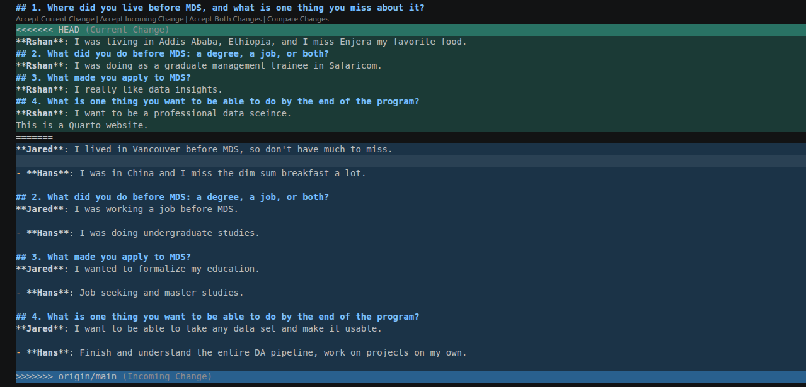

## 1. Where did you live before MDS, and what is one thing you miss about it?
**Jared**: I lived in Vancouver before MDS, so don't have much to miss.
**Ethan**: I lived in Starkville, MS for the past five years and the few things I missed about it are my friends and the short commuting trip.
**Hans**: I was in China and I miss the dim sum breakfast a lot.
**Rshan**: I was living in Addis Ababa, Ethiopia, and I miss Enjera my favorite food.

## 2. What did you do before MDS: a degree, a job, or both?
**Jared**: I was working a job before MDS.
**Ethan**: I completed a master degree at University of Illinois and worked at Mississippi State University as a GIS Developer for five years.
**Hans**: I was doing undergraduate studies on Math and statistics.
**Rshan**: I was doing as a graduate management trainee in Safaricom.

## 3. What made you apply to MDS?
**Jared**: I wanted to formalize my education.
**Ethan**: I would like to embrance the convergance of AI and become more competitive in the current job market.
**Hans**: Job seeking and master studies.
**Rshan**: I really like data insights.

## 4. What is one thing you want to be able to do by the end of the program?
**Jared**: I want to be able to take any data set and make it usable.
**Ethan**: I would like to be capable of utilizing the latest AI tools and build my own AI models.
**Hans**: Finish and understand the entire DA pipeline, work on research projects on my own.
**Rshan**: I want to be a professional data sceince.

## Jared Chuang (jaredc28)

